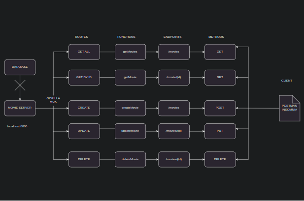

# golang
Eevrything golang repo

### About
Documents all my `golang` related stuff\;
[ ] projects\
[ ] tutorials\
[ ] docs\

### Bookstore
This is an API for a typical bookstore in `golang`

### Architecture

